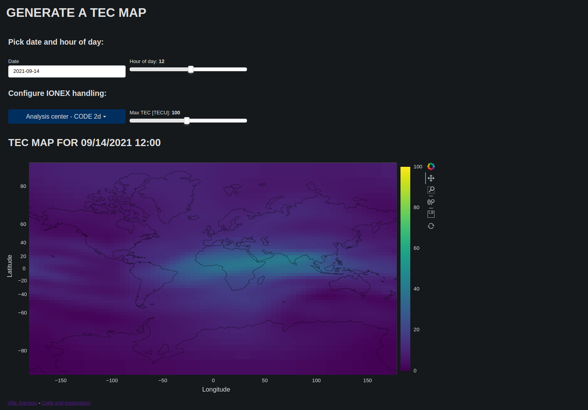

# tecmapper
Tool to generate interactive maps from [Total Electron Content](https://en.wikipedia.org/wiki/Total_electron_content) grids automatically using IGS archive data.

## Intro

TEC maps visualize the spatial distribution of total amount of electorns in Earth's ionosphere. The total electron content in ionosphere affects in the delay of radion and microwaves carrier phases while the waves travel through the ionosphere. The ionospheric delay of the radio signals is a major error source for satellite navigation and this tool is inteded to visualize the severity of the ionospheric delay.

## Method
The tool allows user to select an IGS analysis center, time and date for mapping the TEC. The data is downloaded from IGS archive(s) automatically and if successful, a TEC map is shown to user.

The visualization part is based on [bokeh](https://bokeh.org/) and [geoviews](https://geoviews.org/).

## Example
The tool is running in [an example page](https://tec.jopppis.com/app) where it can be tried out.

The example page is running on low resources so any issues in page viewing might be caused by too much traffic (however unlikely that might be!).

## Usage
1. Install docker
2. Install docker-compose
3. Go to the root of the repository
4. Execute `docker-compose up`
5. Open http://localhost:5100/app on your browser

## TODO
* Add some form of dependency handling (requirements.txt?)
* Add next day and previous day buttons
* Add "play" button to go over hours / days automatically with given intervals
* Add tests
* Improve plotting speed (slow locally, on server fast?)

## Credits
Thanks [daniestevez](https://github.com/daniestevez) for providing similar tool in [a notebook enviornment](https://github.com/daniestevez/jupyter_notebooks/blob/master/IONEX.ipynb) in which the IONEX parsing and handling is based on.
